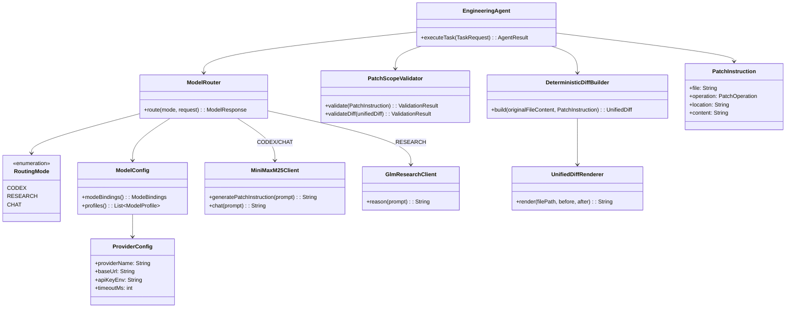

# TARS V2 Deterministic Engineering Agent Redesign

## Goals

This redesign converts TARS from a mixed orchestration model into a deterministic engineering agent with explicit mode routing:

1. Remove reflection loops/retries/persona injection from patch generation paths.
2. Introduce a `ModelRouter` abstraction for **Codex**, **Research**, and **Chat** modes.
3. Use **MiniMax M2.5** for all patch/diff generation.
4. Use **GLM-5/GLM-4.7** only for Research mode planning/reasoning.
5. Replace free-form diff generation with JSON patch instructions and deterministic Java diff assembly.
6. Add explicit model/provider config classes for future expansion.
7. Enforce strict patch path validation (`src/main/java/**`).
8. Route all tool-facing model calls through the new router.
9. Add integration tests for deterministic patch generation behavior.

---

## Proposed High-Level Folder Structure

```text
src/main/java/com/tarsv2/
  agent/
    EngineeringAgent.java
    AgentExecutionPlan.java

  model/
    router/
      ModelRouter.java
      RoutingMode.java
      RoutedModelClient.java
    config/
      ModelConfig.java
      ProviderConfig.java
      ModelProfile.java
      ModeBindings.java

  llm/
    provider/
      minimax/
        MiniMaxM25Client.java
      glm/
        GlmResearchClient.java

  codex/
    instruction/
      PatchInstruction.java            # {file, operation, location, content}
      PatchOperation.java
      PatchInstructionParser.java
    diff/
      DeterministicDiffBuilder.java
      UnifiedDiffRenderer.java
    validate/
      PatchScopeValidator.java         # only src/main/java/**

  tool/
    git/
      GitToolFacade.java
    sandbox/
      SandboxToolFacade.java
    diff/
      DiffToolFacade.java

src/test/java/com/tarsv2/
  integration/
    DeterministicPatchFlowIT.java
    ModelRouterModeSelectionIT.java
    PatchScopeValidatorIT.java
```

Notes:
- Existing `com.tarsv2.model` package can be preserved as the root and split into `router` + `config` subpackages incrementally.
- Existing deterministic diff pieces under `com.tarsv2.codex` can be migrated rather than rewritten.

---

## Target Class Diagram



---

## End-to-End Sequence (Deterministic Patch Mode)

1. `EngineeringAgent` receives code-change task.
2. Agent creates `ModelRequest` with explicit `RoutingMode.CODEX`.
3. `ModelRouter` resolves CODEX mode -> MiniMax M2.5 profile from `ModelConfig`.
4. `MiniMaxM25Client` returns **JSON only** patch instruction:
   ```json
   {"file":"src/main/java/...","operation":"REPLACE","location":"...","content":"..."}
   ```
5. `PatchInstructionParser` deserializes JSON into `PatchInstruction`.
6. `PatchScopeValidator` enforces allowed path (`src/main/java/**`) and operation contract.
7. `DeterministicDiffBuilder` applies operation to in-memory file content.
8. `UnifiedDiffRenderer` emits unified diff deterministically.
9. Git/sandbox tools consume this deterministic diff through shared tool facades (no direct LLM call).

No reflection loops, no retry chains, no persona prompts in this path.

---

## Sequence of Code Changes (Suggested Incremental Plan)

### Phase 1: Router + Config Foundation

1. **Create config package** (`model/config`):
   - `ProviderConfig`
   - `ModelProfile`
   - `ModeBindings`
   - `ModelConfig`
2. **Introduce router package** (`model/router`):
   - `RoutingMode` (reuse existing `Mode` values)
   - `ModelRouter` interface + default implementation
3. Adapt existing `ModeRouter` to delegate to new `ModelRouter` implementation (temporary compatibility shim).

### Phase 2: Provider Isolation

4. Split clients into provider-specific classes:
   - `MiniMaxM25Client` for CODEX + CHAT
   - `GlmResearchClient` for RESEARCH
5. Remove any patch/diff generation call from GLM clients.
6. Ensure chat orchestration uses router with `RoutingMode.CHAT` and minimal deterministic prompting.

### Phase 3: Deterministic Instruction Pipeline

7. Replace free-form patch outputs with `PatchInstruction` schema:
   - fields: `file`, `operation`, `location`, `content`
8. Update codex orchestrator to:
   - request structured JSON only
   - parse to `PatchInstruction`
   - call deterministic diff builder
9. Keep all formatting/hunk generation in Java (`UnifiedDiffRenderer`), not the model.

### Phase 4: Strict Validation + Tool Routing

10. Upgrade validator to fail hard for:
    - non-`src/main/java/**` paths
    - invalid operations
    - missing required fields
11. Refactor git/sandbox/diff entry points to accept router results or instruction objects; remove direct provider calls.
12. Ensure a single deterministic path for patch generation from agent -> router -> validator -> diff builder -> tools.

### Phase 5: Remove Legacy Reflection/Persona Paths

13. Deprecate/remove dual loops from improvement orchestrators for code-change tasks.
14. Remove persona/prompt style injection from codex mode prompt assembly.
15. Remove retry heuristics that alter generated diffs; failures should surface explicitly for operator review.

### Phase 6: Integration Tests

16. Add integration tests:
    - `DeterministicPatchFlowIT`: same input => byte-identical diff output.
    - `ModelRouterModeSelectionIT`: verifies mode-to-provider routing matrix.
    - `PatchScopeValidatorIT`: rejects non-`src/main/java/**` instructions/diffs.
17. Add fixture-based tests with fixed model payload stubs to guarantee deterministic behavior in CI.

---

## Migration Steps from Existing Repository

### A. Existing classes to preserve and adapt

- `com.tarsv2.model.ModeRouter`: keep as adapter while introducing new `ModelRouter` abstraction.
- `com.tarsv2.codex.DeterministicPatchBuilder`: reuse as deterministic core and evolve input contract to `PatchInstruction`.
- `com.tarsv2.codex.PatchValidator`: evolve into stricter `PatchScopeValidator` with instruction + diff validation.

### B. Existing classes to narrow in responsibility

- `com.tarsv2.llm.ChatOrchestrator`: route through `RoutingMode.CHAT` only, minimize prompt decoration.
- `com.tarsv2.codex.CodexOrchestrator`: convert into codex instruction pipeline orchestrator (JSON instruction in, deterministic diff out).
- `com.tarsv2.llm.GlmClient`: constrain usage to research/planning pathways only.

### C. Existing classes/behavior to retire

- Reflection loop semantics in improvement workflows for code patch generation.
- Persona-injected system prompts for codex/code-diff operations.
- Any model-generated unified diff text path.

### D. Compatibility strategy

1. Introduce new interfaces/types first.
2. Add adapters around old entry points.
3. Switch agent/tool call sites incrementally to new abstractions.
4. Remove legacy paths after integration tests pass.

---

## Determinism Guardrails Checklist

- Prompt templates are mode-specific and static.
- Model temperature/top-p enforced to deterministic defaults in CODEX mode.
- JSON schema validation before patch application.
- File-scope validator blocks out-of-scope writes.
- Diff builder is pure function for same `(original, instruction)`.
- Integration tests verify byte-identical outputs for repeated runs.

This architecture keeps TARS flexible for future models while making engineering changes deterministic, auditable, and safe.
